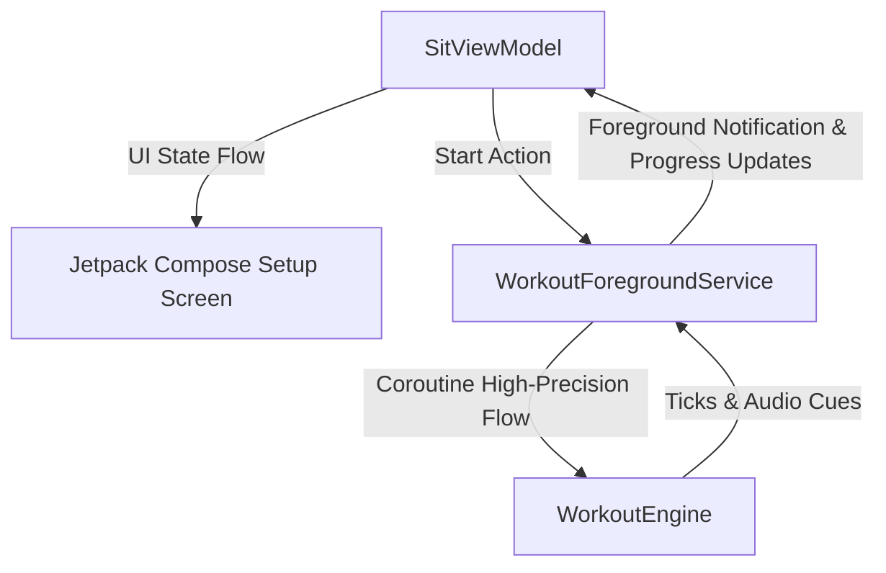

# SPECIFICATION: Native Android Advanced Plus Mode Implementation

This specification serves as the comprehensive architectural and engineering guide for porting the **Advanced Plus Mode** and the core **Top-Down Duration Allocation** mechanism from SIT Web to a native Android application. It describes all structural models, Jetpack Compose layouts, local serialization schemas, foreground services, and localization systems to ensure perfect implementation by an agentic AI or native Android developer.

---

## 📖 1. Overview & Architecture

The Android native implementation of the **Sprint Interval Timer (SIT)** must follow modern Android development best practices:
* **Language:** Kotlin 2.x
* **UI Framework:** Jetpack Compose (Declarative UI)
* **Architecture Pattern:** MVVM (Model-View-ViewModel) + Clean Architecture principles
* **Local Storage:** Room Database or Preferences DataStore (with serialization/deserialization)
* **Timer Background Processing:** Android Native **Foreground Service** combined with a high-precision Kotlin Coroutine tick thread to bypass system-level background limitations (Doze mode and App Standby).



---

## 🛠️ 2. Domain Model & Mathematical Calculations

To maintain perfect math compatibility with the web edition, the domain models must represent simple blocks and recursive loops (repeat blocks) accurately in Kotlin.

### A. Kotlin Data Structures

```kotlin
sealed class Block {
    abstract val id: String
    abstract val type: BlockType
    abstract val details: String
}

enum class BlockType { WARMUP, RUN, WALK, REST, REPEAT }

data class SimpleBlock(
    override val id: String,
    override val type: BlockType,
    val durationSec: Int,
    override val details: String = ""
) : Block()

data class RepeatBlock(
    override val id: String,
    val repeats: Int,
    val steps: List<SimpleBlock>,
    override val details: String = ""
) : Block() {
    override val type: BlockType = BlockType.REPEAT
}
```

### B. Core Duration Calculations
The `WorkoutConfig` class must recursively calculate the dynamic properties:
1. **Total Duration (`totalSec`):**
   $$\text{TotalSec} = \sum \text{durationSec}_{\text{simple}} + \sum \left( \text{repeats} \times \sum \text{durationSec}_{\text{step}} \right)$$
2. **Sprint Count (`sprintCount`):** Count of all sprint (`RUN`) intervals inside simple blocks and nested within loops (multiplied by the loops' repeats).
3. **Total Sprint Seconds (`totalSprintSec`):** Recursive sum of running/sprinting block durations.
4. **Total Rest Seconds (`totalRestSec`):** Recursive sum of walking (`WALK`) and resting (`REST`) block durations.

```kotlin
data class WorkoutConfig(
    val id: String = "current_config",
    val mode: WorkoutMode = WorkoutMode.BASIC,
    val environment: Environment = Environment.OUTDOOR,
    val totalSecBasic: Int = 1800,
    val sprintsBasic: Int = 5,
    val sprintSecBasic: Int = 30,
    val restSecBasic: Int = 90,
    val advancedSprintSecs: List<Int> = listOf(30, 30, 30, 30, 30),
    val advancedPlusBlocks: List<Block> = emptyList()
) {
    val totalSec: Int
        get() = when (mode) {
            WorkoutMode.BASIC -> totalSecBasic
            WorkoutMode.ADVANCED -> totalSecBasic
            WorkoutMode.ADVANCED_PLUS -> advancedPlusBlocks.sumOf { block ->
                when (block) {
                    is SimpleBlock -> block.durationSec
                    is RepeatBlock -> block.repeats * block.steps.sumOf { it.durationSec }
                }
            }
        }
}
```

### C. Interval Timeline Compilation (`WorkoutPlanner`)
To create the chronological timeline of execution steps:
* Compile all blocks into a flat `List<ActiveInterval>` sequence.
* In repeat blocks, flatten the nested list `repeats` times. Set `cycleIndex` of each interval to the current repeat subscript iteration index, and set `isRepeat = true`.

---

## 📂 3. Local Storage Schema

For native Android, save the user configurations to local storage reactively.

### A. DataStore Setup with Kotlin Serialization
Preferences DataStore is highly recommended for storing active preferences. Since `List<Block>` is a polymorphic list, configure a `Json` Kotlinx Serialization string parser:

```kotlin
@Serializable
sealed class BlockDto

@Serializable
@SerialName("SimpleBlock")
data class SimpleBlockDto(
    val id: String,
    val type: String,
    val durationSec: Int,
    val details: String = ""
) : BlockDto()

@Serializable
@SerialName("RepeatBlock")
data class RepeatBlockDto(
    val id: String,
    val repeats: Int,
    val steps: List<SimpleBlockDto>,
    val details: String = ""
) : BlockDto()
```
Store the serialized string using Preferences DataStore key `stringPreferencesKey("advanced_plus_blocks")`.

---

## 🎨 4. Jetpack Compose UI Specification

### A. Color & Typography Tokens
Android native will leverage **Material 3 (`androidx.compose.material3`)** customized with the SIT color palette:
* **Theming Palette (9 Themes):** Map custom dynamic contrast theme tokens via active theme ViewModel status (Classic HSL colors, Classic Dark, Neon, Forest, Forest Dark, Mono, Mono Dark, Glitter, Glitter Dark).
* **Relative Luminance Accessibility Check:**
  Implement a dynamic content color selector using native Android color components:
  ```kotlin
  fun getContrastColor(backgroundColor: Color): Color {
      val r = backgroundColor.red
      val g = backgroundColor.green
      val b = backgroundColor.blue
      val luminance = 0.2126 * r + 0.7152 * g + 0.0722 * b
      return if (luminance > 0.5) Color(0xFF111111) else Color.White
  }
  ```

### B. Segmented Control Layout
Provide a beautiful environment selection segmented row for **AR LIVRE** (Outdoor) and **ESTEIRA** (Treadmill):
* Make it a row of custom rounded outline boxes with animated background color indicators on selection.

### C. Training Blocks Card Deck
Render cards reactively matching the beautiful premium styling rules:
1. **Steppers:** Implement a smooth long-press stepper control for changing repetitions count inside `RepeatBlock` cards.
2. **Horizontal Centerline Alignments:** Align steps index numbers (red bold circle badge), dropdown selections, time pickers (`MM:SS`), and trash icons perfectly along the vertical center of the card row.
3. **Keyboard Auto-Selection:** Whenever any time picker text field receives focus, trigger full selection on the entire string immediately:
   ```kotlin
   val textFieldValueState = remember { mutableStateOf(TextFieldValue(text = "05", selection = TextRange(0, 2))) }
   ```

---

## 🏃 5. Foreground Service & Precision Ticking

Aggressive Android battery management (Doze Mode, App Standby, OEM-specific killing tasks) will pause running tasks unless implemented via an **Android Foreground Service** with a dedicated thread.

### A. High-Precision Coroutine Flow Engine
Use standard system-clock deltas (`System.currentTimeMillis()`) inside a background Coroutine loop running on `Dispatchers.Default` inside the foreground service.
* Do **NOT** use `delay(1000)` relatively. Accumulate elapsed time as `System.currentTimeMillis() - startMs` to remain immune to thread drifts or temporary OS CPU throttling.

### B. Media3 / ExoPlayer Audio Loop Integration
Native Android must register `AudioManager.OnAudioFocusChangeListener` to coordinate background audio:
1. **Autoplay gesture bypass:** User tapping `START WORKOUT` satisfies Android user gesture policies, allowing instant service launch and audio plays.
2. **Audio Ducking:** Configure the `AudioAttributes` for media playback with `USAGE_ASSISTANCE_NAVIGATION_GUIDANCE` or `CONTENT_TYPE_SPEECH` to automatically duck third-party background applications (e.g. Spotify, YouTube Music, Podcasts) during high-intensity loops:
   ```kotlin
   val audioAttributes = AudioAttributes.Builder()
       .setUsage(AudioAttributes.USAGE_ASSISTANCE_NAVIGATION_GUIDANCE)
       .setContentType(AudioAttributes.CONTENT_TYPE_SPEECH)
       .build()
   exoPlayer.setAudioAttributes(audioAttributes, true) // true = handleAudioFocus
   ```
3. **Precise sound triggers:** Wire the service notification loop to loop sprint chase tracks seamlessly (dog barking, dark atmospheric horror sound, electronic tempo beats) only while `IntervalType.SPRINTING` is execution active.

---

## 📋 6. Step-by-Step Implementation Guide for the AI

Use this list as a direct checklist for building the feature:

1. **[ ] Add dependencies:** Include Room/DataStore, Kotlinx Serialization, and Media3/ExoPlayer in the app-level `build.gradle.kts` file.
2. **[ ] Domain setup:** Create the sealed class model for `Block`, simple/repeat data structures, and the planner compiling sequence.
3. **[ ] Storage serializer:** Implement Room type converters or DataStore serialization rules to cleanly save the polymorphic lists.
4. **[ ] Localized resources:** Translate setup strings (Portuguese/English equivalents) inside native `res/values/strings.xml` and `res/values-pt/strings.xml`.
5. **[ ] Dynamic styling coordinator:** Build the Jetpack Compose color palette container mapped to HSL color hex calculations and dynamic typography.
6. **[ ] Core viewmodel:** Implement calculations for dynamic calculated totals (`totalSec`) and validate configurations on active inputs.
7. **[ ] Compose Setup Layout:** Create blocks dynamic builder card deck inside Jetpack Compose, including move up/down, add blocks panel, and delete step controls.
8. **[ ] Foreground Service implementation:** Register `WorkoutForegroundService` with notification channel, ongoing layout notification, and System.currentTimeMillis ticker flow.
9. **[ ] ExoPlayer Sound Coordinator:** Setup AudioManager focus change rules to duck third-party audio during chase sprint sound loops.
10. **[ ] Active UI screen:** Build the execution screen displaying dynamic contrast background colors (using `getContrastColor`), active phase title, cycles indicator, and elapsed progress metrics.
11. **[ ] Unit and Integration Verification:** Write Kotlin JUnit tests verifying division and remainder folding calculations. Validate service lifecycle survival.
